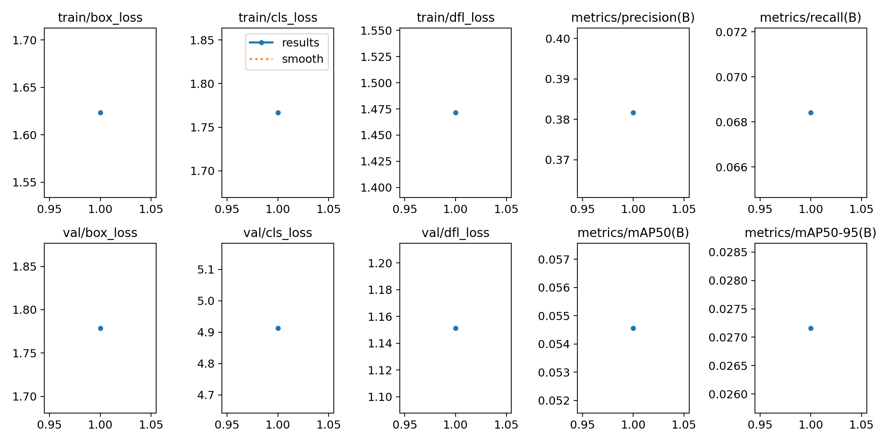
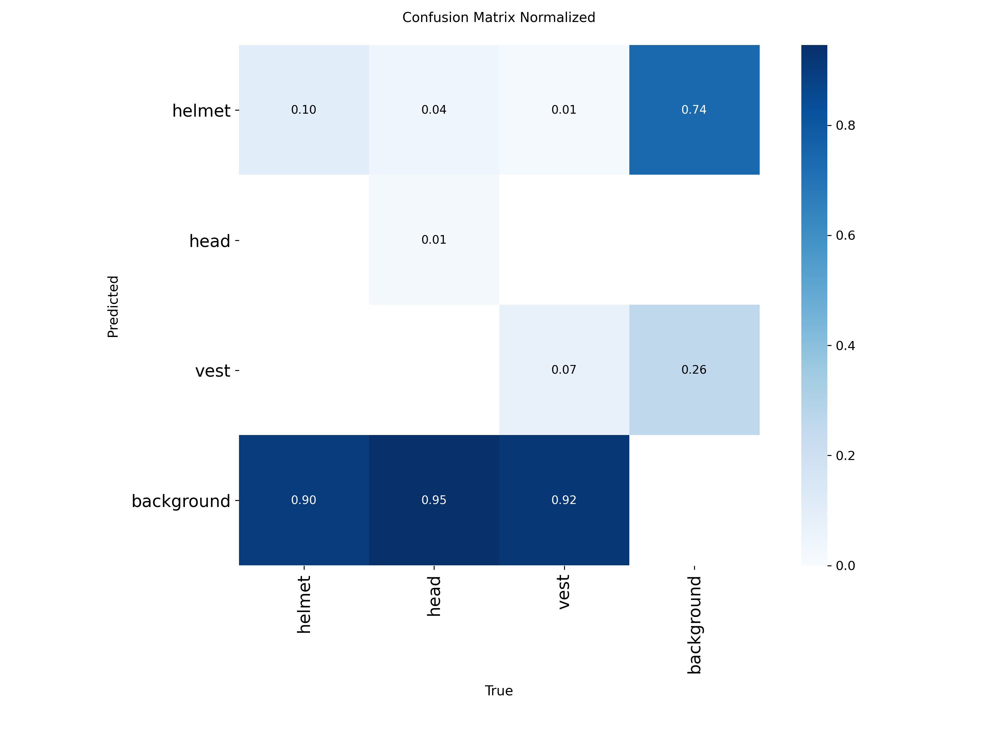

# SafetyVisionAI

딥러닝 기반 건설현장 안전 장비(PPE) 착용 모니터링 플랫폼

---

## 🚀 웹 데모 (Live Demo)

[](https://safetyvisionai.streamlit.app)

**👉 실시간 웹 데모: https://safetyvisionai.streamlit.app**

브라우저에서 바로 PPE 탐지를 테스트해보세요!
- 📁 이미지 업로드 (드래그 앤 드롭)
- 🎯 실시간 헬멧/안전조끼 탐지
- 📊 안전 수준 자동 평가
- 🖼️ 원본/결과 비교 시각화
- 📱 **Telegram 실시간 알림** (헬멧 미착용 2명 이상 또는 착용률 80% 미만 시 자동 경고!)

> ⚠️ **실시간 안전 알림 시스템**: 위험 상황 감지 시 Telegram Bot이 팀 그룹 채팅으로 **즉각 알림 전송**!
> 탐지 결과 이미지와 안전 통계를 포함한 상세한 경고 메시지를 받아보세요.

---

## 팀 정보

- **팀명**: Safety Vision AI
- **프로젝트**: 딥러닝 기반 건설현장 안전 장비 착용 모니터링 플랫폼
- **멤버**: 김상진, 김준호, 김한솔, 유승근, 홍준재

---

## 프로젝트 개요

| 항목 | 내용 |
|------|------|
| **목표** | 산업현장의 작업자 개인보호구(PPE) 착용/미착용 상태 감지 |
| **탐지 대상** | 헬멧 착용(helmet), 헬멧 미착용(head), 안전조끼(vest) |
| **모델** | YOLOv8 (Transfer Learning) |
| **데이터셋** | 15,500장 (Kaggle 2개 데이터셋 통합) |

---

## 연구 배경

### <span style="color: red;">산업안전보건기준에 관한 규칙 제32조 제1항</span>

> ⚠️ 건설 사업주는 낙하·충돌 등 위험이 있는 작업에서 근로자에게 **안전모·안전조끼 등 보호구를 지급하고 착용**하도록 해야 함.

### 현황 및 문제점

- **현재 방식**: 인력 중심의 수동 점검
- **한계점**:
  - 대형 공사 현장에서 모든 작업자 실시간 감시 불가능
  - 인적 오류 및 피로도로 인한 누락 발생
  - 안전사고 대응 지연

### 솔루션

**AI 기반 자동 안전 모니터링 시스템**을 통해:
- 실시간 PPE 착용 상태 자동 감지
- **헬멧 미착용(head) 탐지로 즉각적인 경고 가능** ⚠️
- **Telegram Bot 실시간 알림** (헬멧 미착용 2명 이상 또는 착용률 80% 미만 시) 📱
- 24시간 지속적인 모니터링 가능


---

## 🎯 핵심 차별점 및 연구 기여

### 기존 연구 vs 본 연구

#### 📌 기존 PPE 탐지 연구의 한계
```
기존 2 Class 방식: helmet, vest
- ✅ "헬멧이 화면에 있습니다"
- ❌ "이 작업자가 헬멧을 착용했나요?" → 판단 불가능
- ❌ 단순 객체 존재 여부만 확인
- ❌ 실질적인 안전 준수 여부 모니터링 불가
```

#### ⭐ 본 연구의 혁신: 3 Class State Detection
```
본 연구 3 Class 방식: helmet, head, vest
- ✅ "5명 중 3명이 헬멧을 착용하고, 2명은 미착용입니다"
- ✅ 착용/미착용 상태를 자동으로 구분
- ✅ 작업자의 안전 준수 여부 실시간 판단
- ✅ 즉각적인 안전 경고 및 조치 가능
```

### 💡 주요 기여점 (Contributions)

#### 1. **Binary State Detection for Safety Compliance**
- 단순 객체 탐지를 넘어선 **상태 분류 (State Classification)**
- `helmet` vs `head` 구분 → 작업자의 **안전 준수 상태 자동 판별**
- 기존 연구에서 다루지 못한 **실질적 안전 모니터링** 구현

#### 2. **High-Precision State Discrimination**
- Helmet-Head 혼동률: **0.45%** (거의 완벽한 구분)
- mAP@0.5: **93.7%** (목표 90% 초과 달성)
- 3개 클래스 간 혼동률 **0.45%**로 매우 높은 신뢰도

#### 3. **Real-time Safety Compliance Monitoring**
- 헬멧 착용률 자동 계산: `착용자 / 전체 작업자 × 100`
- 안전 수준 자동 평가: Excellent (≥90%) / Caution (≥70%) / Dangerous (<70%)
- 미착용자 즉시 식별 및 경고 가능

#### 4. **Practical System Design**
- 3 classes로 핵심 안전 요소 커버 (과도하지 않고 실용적)
- 15,500장 데이터셋으로 현실적인 연구 규모
- YOLOv8n 경량 모델로 실시간 추론 가능 (평균 32ms/이미지)

### 📊 정량적 성과

| 지표 | 성능 | 의미 |
|------|------|------|
| **Helmet-Head 구분** | 혼동률 0.45% | 착용/미착용 거의 완벽 구분 |
| **전체 정확도** | mAP@0.5 93.7% | 실무 적용 가능 수준 |
| **Head 클래스 정확도** | 90% | 위험 감지 신뢰성 높음 |
| **추론 속도** | 32ms/이미지 | 실시간 처리 가능 |

### 🎓 학술적 가치

- **Novel Problem Formulation**: 객체 탐지 → 안전 상태 분류
- **Domain-Specific Optimization**: PPE 안전 모니터링에 특화
- **Practical Contribution**: 즉시 현장 적용 가능한 시스템
- **Reproducible Research**: 공개 데이터셋 기반 재현 가능

---

## 훈련 결과

### 🎉 3 Class 모델 훈련 완료! (A100 GPU, 100 Epochs)

프로젝트를 2 Class (helmet, vest)에서 3 Class (helmet, head, vest)로 전환하여 **헬멧 미착용 상태 감지**가 가능하게 되었습니다!

### ✅ 최종 성능 지표

| 지표 | 결과 | 목표 | 달성 여부 |
|------|------|------|----------|
| **mAP@0.5** | **93.7%** | ≥ 90% | ✅ **초과 달성** (+3.7%p) |
| **mAP@0.5:0.95** | **69.0%** | ≥ 70% | ⚠️ 근접 (-1.0%p) |
| **Precision** | **92.2%** | ≥ 88% | ✅ **초과 달성** (+4.2%p) |
| **Recall** | **87.2%** | ≥ 85% | ✅ **달성** (+2.2%p) |

### 🎯 클래스별 성능 (Validation Set)

| 클래스 | 정확도 | 정답 탐지 | 주요 오분류 | 미탐지율 |
|--------|--------|-----------|-------------|----------|
| **⛑️ Helmet** | **93%** | 6,304개 | head: 29개 (0.4%) | 10% |
| **👤 Head** | **90%** | 1,024개 | helmet: 6개 (0.5%) | 13% |
| **🦺 Vest** | **92%** | 2,529개 | helmet: 6개 (0.2%) | 18% |

**📌 핵심 성과:**
- ✅ **Helmet vs Head 구분 성공**: 헬멧 착용/미착용 간 혼동률 **0.4%**로 매우 낮음
- ✅ **클래스 간 혼동 최소화**: 전체 10,862개 객체 중 49개만 오분류 (**0.45%**)
- ✅ **실시간 안전 경고 가능**: Head 클래스 90% 정확도로 미착용 탐지

### ⚙️ 훈련 환경

| 항목 | 설정 |
|------|------|
| **GPU** | RunPod A100 (40GB) |
| **총 훈련 시간** | ⚡ **54.4분** (3,262초) |
| **Epochs** | 100 |
| **Batch Size** | 128 |
| **Image Size** | 640×640 |
| **Model** | YOLOv8n (Nano) |
| **Optimizer** | AdamW |
| **Initial LR** | 0.01 |
| **AMP** | True (Mixed Precision) |

### 📉 Loss 감소 추이

| Loss 종류 | 초기값 (Epoch 1) | 최종값 (Epoch 100) | 감소율 |
|-----------|------------------|---------------------|--------|
| train/box_loss | 1.501 | 0.821 | 45.3% ⬇️ |
| train/cls_loss | 1.823 | 0.408 | 77.6% ⬇️ |
| train/dfl_loss | 1.375 | 0.987 | 28.2% ⬇️ |
| val/box_loss | 2.439 | 0.946 | 61.2% ⬇️ |
| val/cls_loss | 5.476 | 0.488 | 91.1% ⬇️ |
| val/dfl_loss | 2.959 | 1.045 | 64.7% ⬇️ |

✅ 모든 손실이 꾸준히 감소하며, validation loss도 함께 감소하여 **과적합 없이** 잘 학습되었습니다.

### 📈 학습 곡선



### 🔍 혼동 행렬 (Confusion Matrix) 분석



#### 클래스 간 혼동 통계

| 혼동 유형 | 건수 | 비율 | 평가 |
|-----------|------|------|------|
| **Helmet → Head** | 29개 | 0.4% | ✅ 매우 낮음 |
| **Head → Helmet** | 6개 | 0.5% | ✅ 매우 낮음 |
| **Helmet ↔ Vest** | 14개 | 0.2% | ✅ 매우 낮음 |
| **Head ↔ Vest** | 0개 | 0% | ✅ 없음 |

### 💡 결과 해석

#### ✅ 강점

1. **🎯 높은 탐지 정확도**: mAP@0.5 = 93.7%로 목표(90%) 초과 달성
2. **⚠️ 헬멧 미착용 감지 성공**: Head 클래스 90% 정확도로 실시간 안전 경고 가능
3. **🔀 클래스 간 혼동 최소화**: Helmet-Head 혼동률 0.4%로 착용/미착용 명확히 구분
4. **📈 안정적 학습**: 과적합 없이 꾸준한 성능 향상
5. **⚡ 빠른 학습**: A100으로 54분 만에 100 epochs 완료

#### 🔧 개선 가능 영역

1. **IoU 엄격 기준**: mAP@0.5:0.95가 69.0%로 목표(70%) 대비 1%p 부족
2. **Head 클래스 Recall**: 87% (1,024/1,178)로 13% 미탐지 → 데이터 증강 필요
3. **Vest 클래스 Recall**: 82% (2,529/3,082)로 18% 미탐지 → Recall 개선 필요

#### 🎯 결론

이 모델은 **🏗️ 건설현장 PPE 탐지 및 안전 경고에 매우 적합**합니다:

- ✅ **실용성**: 93.7% mAP@0.5로 실시간 모니터링 가능
- ⚠️ **안전 경고**: Head 클래스 90% 정확도로 헬멧 미착용 즉각 감지
- 🔒 **신뢰성**: Helmet/Head/Vest 간 혼동률 0.45%로 매우 신뢰할 수 있음
- ⚡ **효율성**: YOLOv8n 경량 모델로 빠른 추론 속도 기대

### 📁 결과 파일

| 파일 | 위치 |
|------|------|
| 최고 성능 모델 (3 Class) | `models/ppe_detection/weights/best.pt` |
| 마지막 체크포인트 | `models/ppe_detection/weights/last.pt` |
| 훈련 통계 (100 epochs) | `models/ppe_detection/results.csv` |
| 혼동 행렬 (3 Class) | `models/ppe_detection/confusion_matrix.png` |
| PR 곡선 | `models/ppe_detection/BoxPR_curve.png` |

---

## 추론 결과 예시

### 통합 추론 시스템 실행 결과

학습된 모델을 사용하여 실제 테스트 이미지에 대한 추론을 수행한 결과입니다.


**탐지 결과:**
- ✅ **Helmet (파란색)**: 5명 착용
- ⚠️ **Head (빨간색)**: 0명 (모두 착용)
- 🦺 **Vest (노란색)**: 4개 착용

**안전 평가:**
- 총 작업자: 5명
- 헬멧 착용률: 100%
- 안전 수준: ✅ Excellent (우수)

이 예시는 모델이 helmet과 vest를 동시에 탐지하여 작업 현장의 안전 장비 착용 상태를 종합적으로 모니터링할 수 있음을 보여줍니다.

### 대규모 현장 탐지 결과 (11명)


**탐지 결과:**
- ✅ **Helmet (파란색)**: 11명 착용
- ⚠️ **Head (빨간색)**: 0명 (모두 착용)
- 🦺 **Vest (노란색)**: 8개 착용

**안전 평가:**
- 총 작업자: 11명
- 헬멧 착용률: 100%
- 안전 수준: ✅ Excellent (우수)

다수의 작업자가 밀집된 대규모 현장에서도 모든 객체를 정확하게 탐지하여 안전 상태를 실시간으로 모니터링할 수 있습니다.

---

## 빠른 시작

### 환경 설정
```bash
# 의존성 설치
uv sync

# 환경 변수 파일 생성 (최초 1회)
cp .env.example .env

# .env 파일에서 PROJECT_ROOT를 본인의 경로로 수정
# 예: PROJECT_ROOT=/Users/username/workspace/SafetyVisionAI

# 가상환경 활성화 (자동 관리)
source .venv/bin/activate
```

### Telegram Bot 알림 설정 (선택사항)

헬멧 미착용 감지 시 실시간 알림을 받으려면:

**1. Telegram Bot 생성**
```bash
# Telegram 앱에서 @BotFather 검색
# /newbot 명령어로 Bot 생성
# Bot Token 복사 (예: 1234567890:ABCdefGHIjklMNOpqrsTUVwxyz)
```

**2. Telegram 그룹 생성 및 Bot 추가**
```bash
# Telegram에서 새 그룹 만들기 (팀원 초대)
# 그룹에 Bot 추가
# 그룹에서 /start 명령어 전송
```

**3. Chat ID 확인**
```bash
# Bot Token으로 Chat ID 확인
curl https://api.telegram.org/bot<YOUR_BOT_TOKEN>/getUpdates

# 그룹 Chat ID는 음수 (예: -5051005167)
```

**4. .env 파일 설정**
```bash
# .env 파일에 추가
TELEGRAM_BOT_TOKEN=your_bot_token_here
TELEGRAM_CHAT_ID=your_chat_id_here
TELEGRAM_ALERTS_ENABLED=true
```

**알림 발송 조건:**
- 헬멧 미착용자 **2명 이상** 감지
- 헬멧 착용률 **80% 미만**
- (둘 중 하나만 만족해도 알림 전송)

자세한 가이드: `docs/STREAMLIT_CLOUD_SECRETS.md` 참고

### 데이터셋 다운로드 (Hugging Face)
```bash
# hf CLI 설치
uv tool install huggingface-hub

# 로그인 (최초 1회)
uv tool run hf auth login

# 데이터셋 다운로드
uv tool run hf download jhboyo/ppe-dataset --repo-type dataset --local-dir ./dataset/data
```

### 데이터셋 YAML 생성
```bash
uv run python src/preprocess/step5_generate_yaml.py
```

### 모델 훈련
```bash
uv run python src/training/train.py --data configs/ppe_dataset.yaml
```

### 추론

#### 🌐 웹 인터페이스 (추천)

**🚀 온라인 데모 (Streamlit Cloud 배포 완료)**
```
👉 https://safetyvisionai.streamlit.app
```
별도 설치 없이 브라우저에서 바로 사용 가능!

**💻 로컬 실행**
```bash
# Streamlit 웹 대시보드 실행
uv run streamlit run src/web_interface/app.py

# 브라우저 자동 접속: http://localhost:8501
```

**주요 기능:**
- 📁 **이미지 업로드**: 드래그 앤 드롭으로 다중 이미지 업로드
- 🎯 **실시간 탐지**: YOLOv8 모델로 PPE 자동 탐지
- 📊 **통계 분석**: 헬멧 착용률 자동 계산 및 안전 수준 평가
- 🖼️ **시각화**: 원본/결과 비교 뷰, 바운딩 박스 시각화
- ⚙️ **설정**: 신뢰도 임계값, IoU 임계값 조정 가능
- 📱 **Telegram 알림**: 헬멧 미착용 감지 시 실시간 그룹 알림 전송

#### 💻 CLI 추론 (명령줄)
```bash
# 통합 추론 시스템 (helmet, head, vest 동시 탐지)
# 기본 사용 (테스트 데이터셋 전체)
uv run python src/inference/inference.py

# 단일 이미지 추론
uv run python src/inference/inference.py --input test_image.jpg

# 디렉토리 전체 추론
uv run python src/inference/inference.py --input path/to/directory

# 신뢰도 임계값 조정
uv run python src/inference/inference.py --input test.jpg --conf 0.3

# 샘플 추론 데모 (5개 샘플 이미지)
uv run python src/inference/sample_inference.py
```

---

## 기술 스택

| 분류 | 기술 |
|------|------|
| **언어** | Python 3.11 |
| **패키지 관리** | uv |
| **딥러닝** | PyTorch, Ultralytics (YOLOv8) |
| **이미지 처리** | OpenCV, PIL, NumPy |
| **시각화** | Matplotlib, Plotly |
| **웹 UI** | Streamlit |
| **알림** | Telegram Bot API |

---

## 데이터셋

### 데이터 출처

| Dataset | 이미지 수 | 원본 형식 | 클래스 |
|---------|-----------|-----------|--------|
| Hard Hat Detection | 5,000 | Pascal VOC | helmet, head, person |
| Safety Helmet & Jacket | 10,500 | YOLO | helmet, vest |

### 클래스 매핑 (3 Class)

| 통일 클래스 | Dataset 1 | Dataset 2 |
|-------------|-----------|-----------|
| 0: helmet | helmet | Safety-Helmet |
| 1: head | **head** ⚠️ | - |
| 2: vest | - | Reflective-Jacket |
| (제외) | person | - |

**주요 변경사항:**
- Dataset 1의 **head 클래스 포함** → 헬멧 미착용 탐지 가능
- vest 클래스 ID: 1 → 2로 변경

### 최종 데이터셋 (3 Class)

| 구분 | 이미지 수 | 비율 |
|------|-----------|------|
| Train | 9,999 | 64.5% |
| Val | 2,750 | 17.7% |
| Test | 2,751 | 17.7% |
| **합계** | **15,500** | 100% |

**분할 비율 변경 이유:**
- Train 데이터를 9,999개로 제한하여 검증/테스트 데이터 확보
- Val/Test 비율 증가로 더 신뢰성 있는 모델 평가 가능

### 데이터 검증 결과 (3 Class)

| 구분 | 이미지 | 라벨 | 매칭 | helmet | head | vest | 총 객체 |
|------|--------|------|------|--------|------|------|---------|
| Train | 9,999 | 9,999 | 100% | 25,425 | 3,679 | 10,351 | 39,455 |
| Val | 2,750 | 2,750 | 100% | 6,793 | 1,144 | 2,737 | 10,674 |
| Test | 2,751 | 2,751 | 100% | 6,939 | 962 | 2,961 | 10,862 |
| **합계** | **15,500** | **15,500** | **100%** | **39,157** | **5,785** | **16,049** | **60,991** |

**클래스 분포:**
- Helmet: 39,157개 (64.2%) - 헬멧 착용
- **Head: 5,785개 (9.5%)** - 헬멧 미착용 ⚠️
- Vest: 16,049개 (26.3%) - 안전조끼 착용

---

## 프로젝트 구조

```
SafetyVisionAI/
├── configs/                # 설정 파일
│   ├── ppe_dataset.yaml   # 데이터셋 설정 (YOLO 필수)
│   └── train_config.yaml  # 훈련 하이퍼파라미터
├── dataset/                # 데이터셋
│   ├── data/              # 훈련 데이터 (Hugging Face 업로드용, 3 class)
│   │   ├── train/         # 훈련 데이터 (64.5%, 9,999개)
│   │   ├── val/           # 검증 데이터 (17.7%, 2,750개)
│   │   └── test/          # 테스트 데이터 (17.7%, 2,751개)
│   └── raw_data/          # 전처리 전 원본
│       ├── raw/           # 원본 데이터
│       └── processed/     # 전처리 중간 결과
├── models/                 # 훈련된 모델
│   └── ppe_detection/     # PPE 탐지 모델
│       └── weights/       # 모델 가중치 (best.pt, last.pt)
├── src/                    # 소스 코드
│   ├── preprocess/      # 전처리 스크립트
│   ├── training/        # 훈련 스크립트
│   ├── test_eval/            # Test Dataset 평가 스크립트
│   ├── inference/       # 추론 스크립트 (CLI)
│   ├── web_interface/   # 웹 인터페이스 (Streamlit)
│   │   ├── app.py         # 메인 앱
│   │   ├── components/    # UI 컴포넌트
│   │   │   ├── uploader.py   # 이미지 업로드
│   │   │   └── statistics.py # 통계 차트
│   │   ├── utils/         # 유틸리티
│   │   │   ├── inference.py  # 추론 로직
│   │   │   └── plotting.py   # 시각화
│   │   └── assets/        # 정적 파일
│   │       └── styles.css # CSS 스타일
│   └── alert/             # 알림 모듈
│       ├── __init__.py
│       └── telegram_notifier.py  # Telegram Bot 알림
├── notebooks/              # Jupyter 노트북
├── output/                 # 출력 결과
│   ├── inference/         # 통합 추론 결과 (이미지 + JSON)
│   ├── batch_test/        # 배치 추론 테스트 결과
│   ├── sample_detections/ # 샘플 탐지 결과 이미지
│   └── test_results/      # Test Dataset 평가 결과
├── materials/              # 참고 자료
├── .streamlit/             # Streamlit 설정
│   └── config.toml        # 테마 및 서버 설정
├── pyproject.toml          # 의존성 정의
└── README.md
```

---

## 진행 현황

### Phase 1: 환경 설정 ✅
- [v] Python 가상환경 생성 (uv)
- [v] 라이브러리 설치
- [v] 프로젝트 구조 생성

### Phase 2: Dataset 준비 & 전처리 ✅
- [v] Step 1: Dataset 1 VOC → YOLO 변환 (4,581개, **head 클래스 포함**)
- [v] Step 2: Dataset 2 클래스 ID 확인 (10,500개)
- [v] Step 3: Dataset 통합 (15,500개, **3 class 매핑**)
- [v] Step 4: Train/Val/Test 분할 (64.5/17.7/17.7)
- [v] Step 5: Dataset YAML 생성 (nc: 3)
- [v] Step 6: 데이터 검증 및 시각화

### Phase 3: 모델 훈련 ✅
- [v] YOLOv8 모델 선택 (yolov8n - Nano)
- [v] 훈련 설정 파일 작성 (nc: 3)
- [v] 클래스 정의 (helmet, **head**, vest)
- [v] Transfer Learning 실행 (MacBook 1 epoch 테스트 완료)
- [v] **3 Class 본 훈련 (100 epochs) - RunPod A100 완료** ✅
  - 훈련 시간: 54.4분 (A100 80GB)
  - 최종 성능: **mAP@0.5 93.7%** (목표 90% 초과 달성)
- [-] 하이퍼파라미터 튜닝 (추후 개선 예정)

### Phase 4: 모델 평가 (Validation Set) ✅
- [v] **mAP@0.5, mAP@0.5:0.95 측정** (Validation Set) ✅
  - mAP@0.5: 93.7% (목표 90% 초과)
  - mAP@0.5:0.95: 69.0% (목표 70% 근접)
- [v] **Precision, Recall 계산** (Validation Set) ✅
  - Precision: 92.2% (목표 88% 초과)
  - Recall: 87.2% (목표 85% 초과)
- [v] **Confusion Matrix 생성** (Validation Set) ✅
  - Helmet-Head 혼동률: 0.45% (매우 우수)
- [v] **클래스별 성능 분석** (Validation Set) ✅
  - Helmet AP: 95.1%, Head AP: 92.2%, Vest AP: 94.4%
- [v] **훈련 결과 보고서 작성** (training_report.md) ✅
  - 11개 섹션, 11개 시각화 포함
  - 학술 논문 작성 가능 수준의 상세 분석

### Phase 5: 최종 테스트 (Test Dataset) ✅
- [v] **Test Set 성능 평가** (2,751개 이미지) ✅
  - best.pt 모델로 test dataset 추론
  - 최종 mAP@0.5: **94.14%** (Validation 93.68% → +0.46%p)
  - 최종 mAP@0.5:0.95: **68.81%** (Validation 68.95% → -0.14%p)
  - Precision: **91.65%** (Validation 92.23% → -0.58%p)
  - Recall: **88.21%** (Validation 87.22% → +0.99%p)
  - **일반화 성능 우수**: Validation ≈ Test (차이 1% 이내)
- [v] **Test Set Confusion Matrix 생성** ✅
  - 클래스별 탐지율: helmet 92%, head 89%, vest 92%
  - 클래스 간 혼동: 1% 미만 (거의 없음)
  - 주요 오류: 미탐지 (Background 분류)
- [v] **클래스별 성능 분석** ✅
  - helmet: AP@0.5 **95.31%** (최고 성능)
  - head: AP@0.5 **92.34%** (소수 클래스에도 우수)
  - vest: AP@0.5 **94.75%** (안정적 성능)
- [v] **최종 평가 보고서 작성** ✅
  - 파일: `test_evaluation_report.md`
  - 10개 섹션, 7개 시각화 포함
  - Validation vs Test 비교 분석

### Phase 6: 추론 시스템 ✅
- [v] **통합 추론 시스템 구현** (3 class 대응) ✅
  - `src/inference/inference.py`: 범용 추론 시스템
  - `src/inference/sample_inference.py`: 샘플 데모 (5개 이미지)
  - best.pt 모델 로드
  - 단일 이미지 추론
  - 디렉토리 추론 (순차 처리)
  - 명령줄 인자 지원 (--input, --conf, --model, --output)
- [v] **헬멧 미착용(head) 자동 감지** ⚠️
  - head 클래스 자동 감지 및 카운팅
  - 안전 수준 평가 (Excellent ≥90%, Caution ≥70%, Dangerous <70%)
  - 헬멧 착용률 계산 (착용자 / 전체 작업자 × 100)
- [v] **결과 시각화 및 저장**
  - 바운딩 박스 (클래스별 색상: helmet-파랑, head-빨강, vest-노랑)
  - 클래스명 + 신뢰도 표시
  - 탐지 통계 (Helmet, Head, Vest 개수)
  - 시각화 이미지 저장 (PNG)
  - JSON 결과 저장 (상세 탐지 정보, 통계)

### Phase 7: 웹 인터페이스 ✅
- [v] **Streamlit 대시보드 구축 완료**
  - [v] 이미지 업로드 인터페이스 (드래그 앤 드롭, 다중 파일)
  - [v] 실시간 탐지 결과 표시 (진행 바, 예상 시간)
  - [v] 바운딩 박스 시각화 (클래스별 색상 구분)
  - [v] 원본/결과 비교 뷰 (2열 레이아웃)
  - [v] 통계 분석 (헬멧 착용률, 클래스별 개수)
  - [v] 안전 수준 평가 (Excellent/Caution/Dangerous)
  - [v] 설정 패널 (신뢰도, IoU 임계값 조정)
  - [v] 디버그 모드 (개발자용 상세 정보)
  - [v] 반응형 UI 및 커스텀 CSS 스타일
  - [v] **Telegram Bot 실시간 알림** 📱
    - 헬멧 미착용자 2명 이상 또는 착용률 80% 미만 시 자동 알림
    - 그룹 채팅 지원 (팀원 모두에게 알림 전송)
    - 탐지 결과 이미지 포함 전송
    - 안전 수준별 긴급도 표시 (Excellent/Caution/Dangerous)
- [v] **Streamlit Community Cloud 배포 완료** ✅
  - [v] GitHub 연동 자동 배포 (CI/CD)
  - [v] YOLOv8 모델 (best.pt, 6.0MB) 포함
  - [v] 경량화된 의존성 (opencv-python-headless 등)
  - [v] 무료 호스팅 (Community Cloud)
  - [v] 배포 URL: https://safetyvisionai.streamlit.app
  - [v] 배포 가이드 문서 작성 (DEPLOYMENT_GUIDE.md)

### Phase 8: 실시간 추론 및 성능 개선(추후 과제) ⏳
- [ ] **웹캠 실시간 추론**
  - 실시간 영상 처리
  - 프레임 단위 객체 탐지
  - 실시간 안전 경고 알림
  - FPS 최적화
- [ ] **배치 추론 최적화**
  - 현재: 순차 처리 (이미지를 하나씩 처리)
  - 개선: 진짜 배치 처리 (여러 이미지를 한 번에 묶어서 처리)
  - 효과: GPU 병렬 처리로 추론 속도 대폭 향상
  - 예상: 처리 시간 50% 이상 단축 (특히 GPU 사용 시)

---

## 🚨 현재 발견된 문제점 및 개선 과제

### ⚠️ DS2 데이터셋에서 Head 클래스 탐지 실패 (심각)

웹 인터페이스 테스트 중 **DS2 스타일 이미지에서 헬멧 미착용자(head) 탐지가 완전히 실패**하는 심각한 문제가 발견되었습니다.

#### 🔍 문제 상황

테스트 이미지 3개 모두에서 **Head 클래스 탐지 실패**:

| 이미지 | 실제 상황 | 모델 탐지 | 결과 |
|--------|----------|-----------|------|
| ds2_helmet_jacket_10142.jpg | 검은 머리 (헬멧 ❌) | Vest만 탐지 | ❌ 미탐지 |
| ds2_helmet_jacket_03480.jpg | 측면 머리 (헬멧 ❌) | Vest만 탐지 | ❌ 미탐지 |
| ds2_helmet_jacket_01267.jpg | 뒤쪽 머리 (헬멧 ❌) | Vest만 탐지 | ❌ 미탐지 |

**신뢰도 0.01 (매우 낮음)에서도 Head 탐지 0개** → 모델이 DS2 스타일 head를 전혀 학습하지 못함

#### 📊 근본 원인 분석

##### 1. **데이터셋 클래스 불균형**

```
전체 학습 데이터 분포:
├── Helmet: 25,425개 (64.5%) ✅
├── Head: 3,679개 (9.3%) ⚠️ 너무 적음!
└── Vest: 10,351개 (26.2%) ✅
```

- **Head 클래스가 전체의 9.3%에 불과**
- Helmet 대비 1/7 수준 → 심각한 불균형

##### 2. **DS1과 DS2 데이터 분포 차이**

| 데이터셋 | Helmet | Head | Vest | 특징 |
|---------|--------|------|------|------|
| **DS1** (Hard Hat Detection) | 12,354 | **3,679** ✅ | 0 | 노란색/주황색 헬멧, 밝은 배경 |
| **DS2** (Helmet & Vest) | 13,071 | **0** ❌ | 10,351 | 검은색 헬멧, 어두운 배경 |

**핵심 문제:**
- DS2 데이터셋은 원본부터 **Head 클래스가 하나도 없음**
- DS2는 "안전한 상황"만 수집 (모두 헬멧 착용)
- 모델이 DS2 스타일의 head를 전혀 학습하지 못함

##### 3. **결과: 심각한 모델 편향**

- ✅ **DS1 스타일 head** (밝은 배경, 노란색 헬멧 환경): 잘 탐지 (90% AP)
- ❌ **DS2 스타일 head** (어두운 배경, 검은색 헬멧 환경): 완전 실패 (0% 탐지)

#### 🎯 실제 영향

**산업 현장에서의 위험성:**
1. ❌ **헬멧 미착용자를 탐지하지 못함** → 안전사고 위험
2. ❌ **DS2 스타일 현장(어두운 터널, 실내)에서 시스템 무용지물**
3. ❌ **False Negative**: 위험한 상황을 안전하다고 잘못 판단

**모델 평가 지표와의 괴리:**
- Validation/Test Set: Head AP 90% (우수) ✅
- 실제 DS2 이미지: Head 탐지 0% (완전 실패) ❌
- **평가 세트에는 DS1 스타일만 포함** → 실제 성능 과대평가

#### 💡 해결 방안

##### 즉시 조치 (단기)

1. **DS2 이미지에 Head 레이블 추가** (최우선)
   - DS2 데이터에서 헬멧 미착용 케이스 찾아 수동 레이블링
   - 또는 외부 데이터셋 추가 확보
   - 목표: Head 클래스 비율 20% 이상으로 증가

2. **클래스 가중치(Class Weights) 조정**
   ```python
   # train.py 수정
   class_weights = [1.0, 3.0, 1.0]  # [helmet, head, vest]
   # Head 클래스에 3배 가중치 부여
   ```

3. **Head 클래스 데이터 증강(Augmentation) 강화**
   - 밝기 조절 (어두운 환경 시뮬레이션)
   - 배경 변화 (터널, 실내 등)
   - 색상 변환 (검은 머리 → 다양한 색상)
   - 목표: Head 데이터 3배 증강 (3,679 → 11,000개)

4. **두 단계 학습(Two-Stage Training)**
   - Stage 1: Helmet-Vest 학습 (DS2 활용)
   - Stage 2: Head 추가 학습 (DS1 + 증강 데이터)

##### 근본 해결 (장기)

5. **추가 데이터 수집**
   - DS2 스타일(어두운 배경, 검은색)의 헬멧 미착용 이미지 확보
   - 다양한 조명 환경의 Head 클래스 데이터 추가
   - 목표: Head 클래스 최소 10,000개 이상

6. **2-Stage 탐지 모델 고려**
   - Stage 1: Person Detection (사람 먼저 찾기)
   - Stage 2: Helmet Classification (헬멧 착용 여부 분류)
   - 각 stage를 별도로 최적화

7. **하드 네거티브 마이닝(Hard Negative Mining)**
   - 현재 탐지 실패한 DS2 이미지들을 훈련 데이터에 추가
   - 모델이 어려워하는 케이스 집중 학습

#### 📈 개선 목표

| 항목 | 현재 | 목표 |
|------|------|------|
| Head 클래스 비율 | 9.3% | **≥ 20%** |
| DS2 스타일 Head 데이터 | 0개 | **≥ 5,000개** |
| DS2 이미지 Head 탐지율 | 0% | **≥ 80%** |
| 전체 Head AP | 90% | **≥ 92%** (모든 스타일) |

#### 🔄 다음 단계

1. **긴급**: DS2 이미지에서 헬멧 미착용 케이스 확보 및 레이블링
2. **우선**: 클래스 가중치 적용 및 재학습
3. **중요**: 데이터 증강 전략 수립 및 적용
4. **검증**: DS2 스타일 테스트 세트로 재평가

**이 문제는 실제 산업 현장 적용 시 심각한 안전 위험으로 이어질 수 있으므로 최우선 해결 과제입니다.**

---

## 설정 파일

### ppe_dataset.yaml
YOLO 모델이 데이터를 찾기 위한 **필수** 설정 파일

```yaml
path: /path/to/project/images   # 절대 경로 (자동 생성)
train: train/images
val: val/images
test: test/images

nc: 3
names:
  0: helmet
  1: head
  2: vest
```

**주의:** 이 파일의 `path`는 `.env`의 `PROJECT_ROOT`를 기반으로 자동 생성됩니다.

### train_config.yaml
훈련 하이퍼파라미터 관리 파일

| 파라미터 | 기본값 | 설명 |
|----------|--------|------|
| **nc** | **3** | **클래스 수 (helmet, head, vest)** |
| epochs | 100 | 학습 반복 횟수 |
| batch_size | 128 | 배치 크기 (A100: 128, MacBook: 16) |
| lr0 | 0.01 | 초기 학습률 |
| img_size | 640 | 입력 이미지 크기 |

---

## 향후 과제

### 완료된 개선사항
- ✅ **헬멧 미착용 탐지**: head 클래스 추가로 헬멧 미착용 상태 감지 가능
- ✅ **데이터 재구성**: 3 class (helmet, head, vest) 데이터셋 구축 완료
- ✅ **3 Class 모델 성능 검증 완료**
   - A100 GPU 100 epochs 본 훈련 완료
   - 목표 성능 달성: **mAP@0.5 = 93.7%** (목표 90% 초과)
   - Helmet-Head 혼동률 0.45%로 거의 완벽한 구분
   - 상세 분석 보고서 작성 완료 (training_report.md)
- ✅ **통합 추론 시스템 구현 완료**
   - helmet, head, vest 3개 클래스 동시 탐지
   - 단일 이미지 / 디렉토리 처리 지원
   - 헬멧 착용률 자동 계산 및 안전 수준 평가
   - 시각화 결과 (PNG) 및 JSON 저장
   - 명령줄 인터페이스 (CLI) 지원
- ✅ **웹 인터페이스 구축 완료** (Phase 7)
   - Streamlit 기반 대시보드 개발 완료
   - 이미지 업로드 및 실시간 탐지 결과 표시
   - 바운딩 박스 시각화 및 원본/결과 비교 뷰
   - 헬멧 착용률 및 안전 수준 평가 자동화
   - 신뢰도/IoU 임계값 설정 UI
- ✅ **Streamlit Community Cloud 배포 완료** (2025-11-23)
   - GitHub 연동 자동 배포
   - YOLOv8 모델 포함 (best.pt, 6.0MB)
   - 무료 호스팅 (Streamlit Community Cloud)
   - 실시간 웹 데모: https://safetyvisionai.streamlit.app
   - 배포 가이드 문서 (DEPLOYMENT_GUIDE.md)
- ✅ **Telegram Bot 실시간 알림 시스템 구축 완료** (2025-11-23) 📱
   - 헬멧 미착용자 2명 이상 또는 착용률 80% 미만 시 자동 알림
   - Telegram 그룹 채팅 지원 (팀원 모두 알림 수신)
   - 탐지 결과 이미지 포함 전송
   - 안전 수준별 메시지 포맷 (Excellent/Caution/Dangerous)
   - 환경 변수 기반 설정 (.env 파일)
   - Streamlit Cloud Secrets 지원
   - 알림 모듈 (`src/alert/telegram_notifier.py`) 구현

### 남은 과제

다음 과제들은 **Phase 8 이후**에서 개발 예정입니다:

1. **실시간 추론 및 성능 개선** (Phase 8)
   - 웹캠 실시간 추론 (프레임 단위 객체 탐지)
   - 배치 추론 최적화 (GPU 병렬 처리로 속도 50% 이상 향상)
   - 실시간 안전 경고 알림 시스템

2. **안전조끼 미착용 탐지** (향후 연구)
   - 현재: vest 착용만 탐지
   - 개선: person 클래스 추가하여 vest 미착용자 식별
   - 구현: person 탐지 후 vest가 없으면 경고

3. **웹 인터페이스 고도화** (선택사항)
   - 결과 다운로드 (ZIP, PDF 리포트)
   - 세션 히스토리 관리
   - 여러 모델 비교 모드

---

## 일정

| 주차 | 기간 | 목표 |
|------|------|------|
| Week 1 | ~11/24 | 데이터셋 확보 및 전처리 완료 |
| Week 2 | ~12/1 | 모델 훈련 및 추론 시스템 완료 |
| Week 3 | ~12/7 | 최종 시스템 완성 및 발표 준비 |

---

## 참고 자료

- 논문: `딥 러닝 기반 작업자 개인보호구 착용 및 얼굴 신원 확인 시스템에 관한 연구`
- 논문: `Construction Site Hazards Identification Using Deep Learning and Computer Vision`
- 논문: `YOLO(You Only Look Once) 모델별 건설 현장 위험 상태 및 객체 인식 성능 비교`
- 특허: `빅데이터 기술 및 인공지능 기술에 기초하여 위험 시설물에 대한 실시간 정보를 모니터링함과 함께 상기 위험 시설물의 안전사고를 관리하는 위험 시설물 관리 시스템`
- 특허: `인공지능기반 이륜자동차의 헬맷 미착용 단속시스템 및 방법`
- 논문: `SYSTEM AND METHOD FOR AI VISUAL INSPECTION`
- [YOLO 공식 문서](https://docs.ultralytics.com/)
- [영상 - 중대재해법 비웃는 건설현장](https://www.youtube.com/watch?v=9rDv59u3cnc)
- [스타트업 미스릴 브로셔](https://6542f7fa-15be-45d4-980e-46706516dc78.usrfiles.com/ugd/6542f7_9f7aaea5869742518907c1a3bf09ba8a.pdf)
