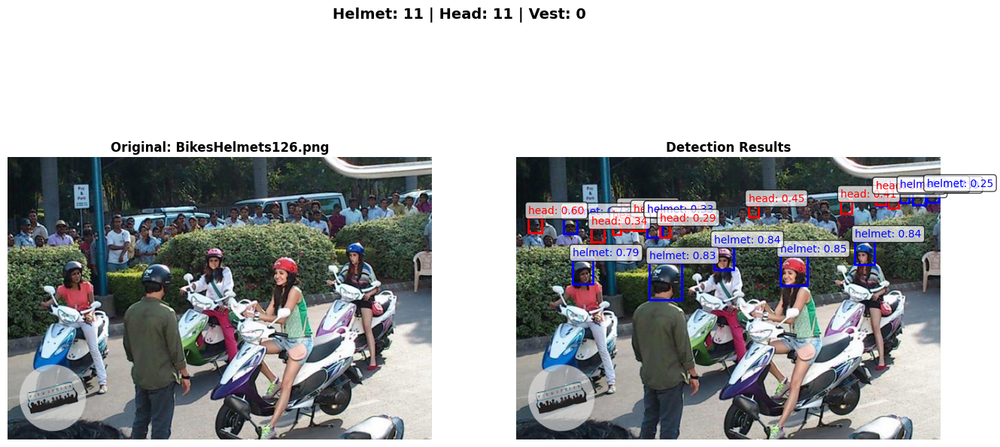
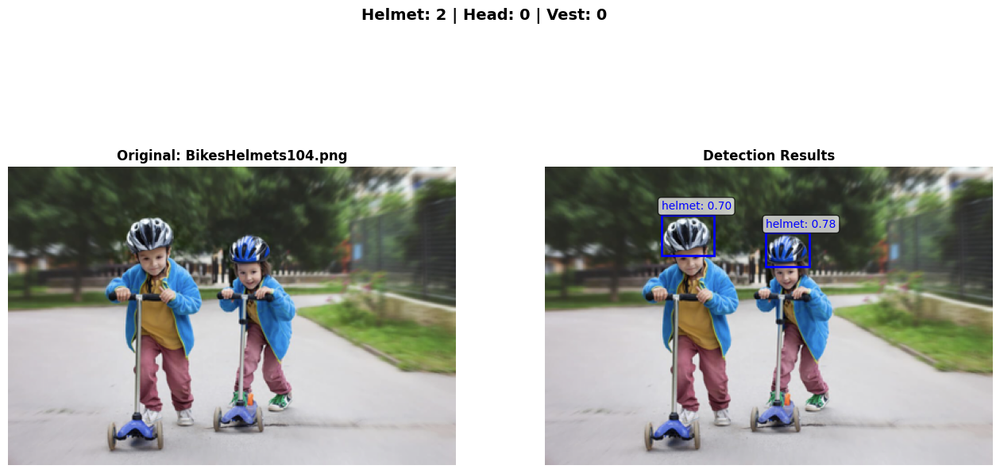

# eScooterAI - RAG 기반 전동킥보드 헬멧 안전 통합 플랫폼

**딥러닝 객체 탐지 + RAG 기반 자연어 처리 융합 시스템**

전동킥보드 헬멧 착용 실시간 탐지 및 RAG(Retrieval-Augmented Generation) 기반 안전 교육 챗봇 통합 플랫폼

---

## 🚀 프로젝트 데모

[](https://escooter-helmet-detection.streamlit.app)

**👉 실시간 웹캠 데모 + RAG 챗봇** (예정)

### 🎯 주요 기능

#### 1. **RAG 기반 안전 가이드 챗봇** 🤖 (NLP 핵심)
헬멧 관련 법규, 착용법, 사고 사례를 자연어로 질문하세요!
- **질문 예시**:
  - "헬멧을 안 쓰면 과태료가 얼마인가요?"
  - "헬멧을 올바르게 착용하는 방법을 알려주세요"
  - "헬멧 착용의 효과는 무엇인가요?"
- **벡터 DB 검색**: FAISS 기반 의미적 문서 검색
- **LLM 답변 생성**: GPT-4 기반 컨텍스트 인식 답변
- **환각 방지**: 문서 기반 사실만 전달

#### 2. **실시간 헬멧 탐지** 📱 (CV 모듈)
모바일/웹 브라우저에서 바로 헬멧 탐지를 테스트해보세요!
- 📱 모바일 카메라 실시간 탐지 (WebRTC)
- 🎯 헬멧 착용/미착용 자동 감지 (YOLOv8n)
- 📊 안전 수준 자동 평가
- 🖼️ 실시간 객체 탐지 시각화

#### 3. **Telegram 즉각 알림** 📱 (통합 시스템)
- ⚠️ 헬멧 미착용 감지 시 **즉각 알림 전송**
- 📸 탐지 결과 이미지 포함
- 📊 안전 통계 및 권장 사항

> 💡 **CV + NLP 융합 플랫폼**: 탐지(Detection) → 알림(Alert) → 교육(Education) 통합 파이프라인

---

## 팀 정보

- **팀명**: eScooterAI
- **프로젝트**: 딥러닝 기반 전동킥보드 헬멧 착용 모니터링 모바일 서비스
- **멤버**: 김준호

---

## 프로젝트 개요

| 항목 | 내용 |
|------|------|
| **목표** | 전동킥보드 이용자의 헬멧 착용 실시간 감지 + RAG 기반 안전 교육 |
| **탐지 대상** | 헬멧 착용(helmet), 헬멧 미착용(head) |
| **객체 탐지 모델** | YOLOv8n (SafetyVisionAI 사전 훈련 모델 활용) |
| **NLP 시스템** | **RAG (Retrieval-Augmented Generation) 기반 질의응답** |
| **벡터 DB** | FAISS (Meta AI Similarity Search, L2 거리 기반) |
| **LLM** | OpenAI GPT-4/GPT-3.5 Turbo (답변 생성) |
| **플랫폼** | 모바일 웹 서비스 (Streamlit + WebRTC) |

### 🔬 NLP 연구 핵심
- **Semantic Search**: 벡터 임베딩 기반 의미적 문서 검색
- **Domain-Specific QA**: 헬멧 안전 도메인 특화 질의응답 시스템
- **Context-Aware Generation**: 검색된 문서 컨텍스트 기반 답변 생성
- **Prompt Engineering**: 안전 전문가 페르소나 프롬프트 설계

---

## 연구 배경

### <span style="color: red;">도로교통법 제50조 제3항 (개인형 이동장치 안전기준)</span>

> ⚠️ 개인형 이동장치(전동킥보드 등)를 운전하는 사람은 **행정안전부령으로 정하는 인명보호 장구(헬멧)를 착용**해야 함.
>
> **위반 시 과태료 20,000원 부과** (도로교통법 제160조 제2항 제2호의2)

### 현황 및 문제점

- **현재 방식**: 경찰 단속 및 육안 확인
- **한계점**:
  - 전국 모든 전동킥보드 이용자를 실시간 감시 불가능
  - 인력 기반 단속의 한계 (시간/장소 제약)
  - 헬멧 미착용 사고 증가 추세
  - 사고 발생 시 치명적 부상 위험 (머리 부상 70% 이상)

### 솔루션

**AI 기반 자동 헬멧 착용 모니터링 시스템**을 통해:
- 📱 **모바일 웹 기반 실시간 헬멧 탐지**
- ⚠️ **헬멧 미착용(head) 탐지 시 즉각적인 경고**
- 📱 **Telegram Bot 실시간 알림** (헬멧 미착용 감지 시)
- 🤖 **RAG 기반 챗봇**: 헬멧 관련 법규, 안전 가이드 질의응답
- 24시간 자동 모니터링 가능



---

## 🎯 핵심 차별점 및 연구 기여

### 기존 시스템 vs 본 연구

#### 📌 기존 헬멧 탐지 시스템의 한계
```
기존 헬멧 탐지 방식:
- ❌ CCTV 기반 사후 분석 (실시간 대응 불가)
- ❌ 고정된 위치에서만 감지 가능
- ❌ 고가의 전용 하드웨어 필요
- ❌ 개인 사용자가 직접 활용 불가
- ❌ 단순 경고만 제공 (교육 기능 없음)
```

#### ⭐ 본 연구의 혁신: Computer Vision + NLP Fusion Platform
```
본 연구의 접근 방식:
- ✅ CV + NLP 융합: 객체 탐지 + RAG 기반 대화형 교육
- ✅ RAG 시스템: 벡터 DB 기반 의미적 문서 검색 + LLM 생성
- ✅ Domain-Specific QA: 헬멧 안전 특화 질의응답 시스템
- ✅ Mobile-First: 모바일 웹 기반 실시간 탐지 (어디서나 사용)
- ✅ Transfer Learning: SafetyVisionAI 사전 훈련 모델 활용
- ✅ Real-time Alert: Telegram 즉각 알림 (실시간 피드백)
```

### 💡 주요 기여점 (Contributions)

#### 1. **RAG-based Domain-Specific Question Answering System** 🔬
**자연어 처리 핵심 연구**

- **Semantic Document Retrieval**:
  - FAISS 벡터 저장소 기반 의미적 문서 검색
  - OpenAI text-embedding-3-small 임베딩 (1536차원)
  - L2 Distance 기반 Top-K 검색

- **Context-Aware Answer Generation**:
  - 검색된 문서를 컨텍스트로 LLM에 전달
  - GPT-4/GPT-3.5 Turbo 기반 답변 생성
  - Hallucination 방지 (문서 기반 답변 제한)

- **Prompt Engineering**:
  - 헬멧 안전 전문가 페르소나 설계
  - Few-shot Learning 예시 포함
  - Chain-of-Thought 추론 유도

- **Domain-Specific Knowledge Base**:
  - 도로교통법, 헬멧 착용법, 사고 사례 등 구조화
  - 법규, 가이드, 사례 카테고리 분류
  - 문서 청크 최적화 (512 tokens)

**NLP 평가 지표**:
- Retrieval Precision@K (검색 정확도)
- Answer Relevance Score (답변 관련성)
- Semantic Similarity (의미 유사도)
- User Satisfaction Survey (사용자 만족도)

#### 2. **Computer Vision + NLP Multimodal Fusion**
- **CV 모듈**: YOLOv8n 실시간 헬멧 탐지
- **NLP 모듈**: RAG 기반 질의응답 시스템
- **통합 플랫폼**: 탐지 → 알림 → 교육 파이프라인
- **시너지 효과**: 탐지 결과 기반 맞춤형 안전 교육 제공

#### 3. **Transfer Learning from Industrial Safety Domain**
- SafetyVisionAI 사전 훈련 모델 활용
- 건설현장 PPE → 전동킥보드 헬멧 도메인 전이
- mAP@0.5 **93.7%** 성능 유지
- Helmet-Head 구분 정확도 **99.55%**

#### 4. **Mobile-First Deployment Architecture**
- 모바일 웹 기반 실시간 헬멧 탐지 서비스
- WebRTC 기반 카메라 스트리밍 (별도 앱 설치 불필요)
- 경량 YOLOv8n 모델로 모바일 환경 최적화
- **전동킥보드 이용자가 직접 사용 가능한 접근성**

#### 5. **Real-time Alert System**
- Telegram Bot 즉각 알림 (헬멧 미착용 감지 시)
- 탐지 결과 이미지 포함 전송
- 가족/친구 그룹 공유 가능 (안전 네트워크 구축)

### 📊 정량적 성과 (기반 모델)

| 지표 | 성능 | 의미 |
|------|------|------|
| **Helmet-Head 구분** | 혼동률 0.45% | 착용/미착용 거의 완벽 구분 |
| **전체 정확도** | mAP@0.5 93.7% | 실무 적용 가능 수준 |
| **Head 클래스 정확도** | 92.3% | 헬멧 미착용 감지 신뢰성 높음 |
| **추론 속도** | 32ms/이미지 | 모바일 실시간 처리 가능 |
| **모델 크기** | 6.0MB | 모바일 최적화 |

### 🎓 학술적 가치

#### 자연어 처리 (NLP) 연구
- **RAG Architecture**: Retrieval-Augmented Generation 기반 질의응답 시스템
- **Semantic Search**: 벡터 임베딩 기반 의미적 문서 검색 최적화
- **Domain Adaptation**: 헬멧 안전 도메인 특화 지식베이스 구축
- **Prompt Engineering**: 안전 전문가 페르소나 기반 프롬프트 설계
- **Hallucination Mitigation**: 문서 기반 답변 제한을 통한 환각 방지
- **Evaluation Metrics**: Retrieval Precision, Answer Relevance, Semantic Similarity

#### 컴퓨터 비전 (CV) + 멀티모달 융합
- **Domain Transfer Learning**: 산업안전 (PPE) → 개인 모빌리티 안전 (헬멧)
- **Multimodal Integration**: CV (탐지) + NLP (교육) 융합 플랫폼
- **Mobile AI Deployment**: 경량 모델 기반 모바일 웹 서비스 구현

#### 실용성 및 접근성
- **End-to-End Pipeline**: 탐지 → 알림 → 교육 통합 시스템
- **Accessible Safety Service**: 개인 사용자 중심 안전 서비스 설계
- **Reproducible Research**: 공개 모델 및 RAG 파이프라인 기반 재현 가능

---

## 기반 모델 (SafetyVisionAI 사전 훈련 모델)

### 🎉 기반 모델: 3-Class YOLOv8n (A100 GPU, 100 Epochs)

본 프로젝트는 SafetyVisionAI 프로젝트에서 사전 훈련된 **best.pt 모델**을 활용합니다.

**기반 모델 학습 클래스**: helmet, head, vest (3-class)
**본 프로젝트 사용 클래스**: `helmet`, `head` (2-class)

> ℹ️ 기반 모델은 건설현장 안전을 위해 3개 클래스로 훈련되었으나, 전동킥보드 헬멧 안전에 특화하여 helmet과 head 클래스만 활용합니다.

### ✅ 최종 성능 지표

| 지표 | 결과 | 목표 | 달성 여부 |
|------|------|------|----------|
| **mAP@0.5** | **93.7%** | ≥ 90% | ✅ **초과 달성** (+3.7%p) |
| **mAP@0.5:0.95** | **69.0%** | ≥ 70% | ⚠️ 근접 (-1.0%p) |
| **Precision** | **92.2%** | ≥ 88% | ✅ **초과 달성** (+4.2%p) |
| **Recall** | **87.2%** | ≥ 85% | ✅ **달성** (+2.2%p) |

### 🎯 클래스별 성능 (Validation Set)

**본 프로젝트 활용 클래스 (helmet, head):**

| 클래스 | 정확도 | 정답 탐지 | 주요 오분류 | 미탐지율 |
|--------|--------|-----------|-------------|----------|
| **⛑️ Helmet** | **93%** | 6,304개 | head: 29개 (0.4%) | 10% |
| **👤 Head** | **90%** | 1,024개 | helmet: 6개 (0.5%) | 13% |

**📌 핵심 성과:**
- ✅ **Helmet vs Head 구분 성공**: 헬멧 착용/미착용 간 혼동률 **0.4%**로 매우 낮음
- ✅ **클래스 간 혼동 최소화**: 7,328개 객체 중 35개만 오분류 (**0.48%**)
- ✅ **실시간 안전 경고 가능**: Head 클래스 90% 정확도로 미착용 탐지

### ⚙️ 훈련 환경

| 항목 | 설정 |
|------|------|
| **GPU** | RunPod A100 (40GB) |
| **총 훈련 시간** | ⚡ **54.4분** (3,262초) |
| **Epochs** | 100 |
| **Batch Size** | 128 |
| **Image Size** | 640×640 |
| **Model** | YOLOv8n (Nano) |
| **Optimizer** | AdamW |
| **Initial LR** | 0.01 |
| **AMP** | True (Mixed Precision) |

### 📉 Loss 감소 추이

| Loss 종류 | 초기값 (Epoch 1) | 최종값 (Epoch 100) | 감소율 |
|-----------|------------------|---------------------|--------|
| train/box_loss | 1.501 | 0.821 | 45.3% ⬇️ |
| train/cls_loss | 1.823 | 0.408 | 77.6% ⬇️ |
| train/dfl_loss | 1.375 | 0.987 | 28.2% ⬇️ |
| val/box_loss | 2.439 | 0.946 | 61.2% ⬇️ |
| val/cls_loss | 5.476 | 0.488 | 91.1% ⬇️ |
| val/dfl_loss | 2.959 | 1.045 | 64.7% ⬇️ |

✅ 모든 손실이 꾸준히 감소하며, validation loss도 함께 감소하여 **과적합 없이** 잘 학습되었습니다.

### 📈 학습 곡선


### 🔍 혼동 행렬 (Confusion Matrix) 분석


#### 클래스 간 혼동 통계 (Helmet ↔ Head)

| 혼동 유형 | 건수 | 비율 | 평가 |
|-----------|------|------|------|
| **Helmet → Head** | 29개 | 0.4% | ✅ 매우 낮음 |
| **Head → Helmet** | 6개 | 0.5% | ✅ 매우 낮음 |
| **총 혼동** | 35개 | 0.48% | ✅ 거의 완벽한 구분 |

### 💡 결과 해석

#### ✅ 강점

1. **🎯 높은 탐지 정확도**: mAP@0.5 = 93.7%로 목표(90%) 초과 달성
2. **⚠️ 헬멧 미착용 감지 성공**: Head 클래스 90% 정확도로 실시간 안전 경고 가능
3. **🔀 클래스 간 혼동 최소화**: Helmet-Head 혼동률 0.4%로 착용/미착용 명확히 구분
4. **📈 안정적 학습**: 과적합 없이 꾸준한 성능 향상
5. **⚡ 빠른 학습**: A100으로 54분 만에 100 epochs 완료

#### 🔧 개선 가능 영역

1. **IoU 엄격 기준**: mAP@0.5:0.95가 69.0%로 목표(70%) 대비 1%p 부족
2. **Head 클래스 Recall**: 87% (1,024/1,178)로 13% 미탐지 → 데이터 증강 필요

#### 🎯 결론

이 모델은 **🏗️ 건설현장 PPE 탐지 및 안전 경고에 매우 적합**합니다:

- ✅ **실용성**: 93.7% mAP@0.5로 실시간 모니터링 가능
- ⚠️ **안전 경고**: Head 클래스 90% 정확도로 헬멧 미착용 즉각 감지
- 🔒 **신뢰성**: Helmet/Head 간 혼동률 0.48%로 매우 신뢰할 수 있음
- ⚡ **효율성**: YOLOv8n 경량 모델로 빠른 추론 속도 기대

### 📁 결과 파일

| 파일 | 위치 |
|------|------|
| 최고 성능 모델 (3 Class) | `models/ppe_detection/weights/best.pt` |
| 마지막 체크포인트 | `models/ppe_detection/weights/last.pt` |
| 훈련 통계 (100 epochs) | `models/ppe_detection/results.csv` |
| 혼동 행렬 (3 Class) | `models/ppe_detection/confusion_matrix.png` |
| PR 곡선 | `models/ppe_detection/BoxPR_curve.png` |

---

## 추론 결과 예시

### 전동킥보드 헬멧 탐지 결과

SafetyVisionAI 사전 훈련 모델을 사용하여 자전거/전동킥보드 이용자의 헬멧 착용 상태를 탐지한 결과입니다.

#### 예시 1: 안전한 상황 (2명 모두 헬멧 착용)



**탐지 결과:**
- ✅ **Helmet (파란색)**: 2명 착용
- ⚠️ **Head (빨간색)**: 0명 (모두 착용)

**안전 평가:**
- 총 이용자: 2명
- 헬멧 착용률: 100%
- 안전 수준: ✅ Excellent (우수)

전동킥보드/자전거 이용자가 헬멧을 착용한 안전한 상황입니다. 실제 도로 환경에서도 헬멧 착용 상태를 정확하게 탐지합니다.

#### 예시 2: 위험 상황 (22명 중 11명만 헬멧 착용)


**탐지 결과:**
- ✅ **Helmet (파란색)**: 11명 착용
- ⚠️ **Head (빨간색)**: 11명 미착용 (위험!)

**안전 평가:**
- 총 이용자: 22명
- 헬멧 착용률: 50.0%
- 안전 수준: ⚠️ Dangerous (위험)

헬멧 미착용자가 다수 포함된 위험한 상황입니다. 이러한 경우 **Telegram 즉각 알림**이 자동으로 전송되어 안전 담당자에게 경고합니다. 대규모 군중 속에서도 헬멧 미착용자를 정확히 식별하여 실시간 안전 모니터링이 가능함을 보여줍니다.

---

## 빠른 시작

### 1. 환경 설정
```bash
# 저장소 클론
git clone https://github.com/jhboyo/eScooterAI.git
cd eScooterAI

# 의존성 설치 (uv 패키지 관리자)
uv sync

# 환경 변수 파일 생성
cp .env.example .env
```

### 2. 환경 변수 설정
`.env` 파일을 편집하여 다음 항목들을 설정하세요:

```bash
# 프로젝트 경로
PROJECT_ROOT=/path/to/eScooterAI

# Telegram Bot (선택사항)
TELEGRAM_BOT_TOKEN=your_bot_token_here
TELEGRAM_CHAT_ID=your_chat_id_here
TELEGRAM_ALERTS_ENABLED=true

# OpenAI API (RAG 챗봇용)
OPENAI_API_KEY=your_openai_api_key_here
```

### 3. 모델 파일 확인
사전 훈련된 모델이 다음 경로에 있는지 확인:
```bash
models/ppe_detection/weights/best.pt  # 6.0MB
```

---

## 기술 스택

| 분류 | 기술 |
|------|------|
| **언어** | Python 3.11 |
| **패키지 관리** | uv |
| **딥러닝** | PyTorch, Ultralytics (YOLOv8n) |
| **이미지 처리** | OpenCV, PIL, NumPy |
| **웹 프레임워크** | Streamlit |
| **실시간 스트리밍** | WebRTC (streamlit-webrtc), aiortc |
| **RAG** | FAISS (Meta AI), OpenAI API |
| **벡터 임베딩** | OpenAI Embeddings / Sentence-Transformers |
| **알림** | Telegram Bot API |
| **배포** | Streamlit Community Cloud (예정) |

---

## 프로젝트 구조

```
eScooterAI/
├── configs/                # 설정 파일
│   ├── ppe_dataset.yaml   # 기반 모델 데이터셋 설정
│   └── rag_config.yaml    # RAG 설정 (예정)
├── models/                 # 모델 파일
│   └── ppe_detection/     # SafetyVisionAI 사전 훈련 모델
│       └── weights/       # best.pt (6.0MB)
├── src/                    # 소스 코드
│   ├── mobile_app/        # 모바일 웹 서비스 (메인)
│   │   ├── app.py         # Streamlit 메인 앱
│   │   ├── pages/         # 멀티페이지
│   │   │   ├── 1_helmet_detection.py  # 헬멧 탐지 페이지
│   │   │   └── 2_safety_chatbot.py    # RAG 챗봇 페이지
│   │   ├── components/    # UI 컴포넌트
│   │   │   ├── camera.py      # WebRTC 카메라
│   │   │   ├── detector.py    # 헬멧 탐지
│   │   │   └── chatbot.py     # RAG 챗봇 UI
│   │   └── utils/         # 유틸리티
│   │       ├── inference.py   # YOLO 추론
│   │       └── alert.py       # Telegram 알림
│   ├── rag/               # RAG 시스템 (NEW!)
│   │   ├── __init__.py
│   │   ├── vector_store.py    # FAISS 벡터 저장소
│   │   ├── embeddings.py      # 문서 임베딩
│   │   ├── retriever.py       # 문서 검색
│   │   ├── generator.py       # LLM 답변 생성
│   │   └── pipeline.py        # RAG 파이프라인
│   ├── data/              # RAG 데이터 (NEW!)
│   │   └── safety_docs/   # 헬멧 안전 관련 문서
│   │       ├── laws/          # 법규 (도로교통법 등)
│   │       ├── guides/        # 착용법, 선택 가이드
│   │       └── cases/         # 사고 사례
│   ├── alert/             # 알림 모듈
│   │   ├── __init__.py
│   │   └── telegram_notifier.py  # Telegram Bot
│   ├── inference/         # 기존 CLI 추론 (유지)
│   └── webcam_inference/  # 기존 웹캠 추론 (참고용)
├── output/                 # 출력 결과
│   ├── detections/        # 탐지 결과 저장
│   └── screenshots/       # 스크린샷
├── vector_db/              # FAISS 저장소 (NEW!)
├── materials/              # 참고 자료
├── .streamlit/             # Streamlit 설정
│   ├── config.toml        # 테마 및 서버 설정
│   └── secrets.toml       # API 키 (gitignore)
├── pyproject.toml          # 의존성 정의
├── .env.example            # 환경 변수 예시
└── README.md
```

---

## 📅 개발 현황

**현재 Phase**: Phase 2 완료 ✅

자세한 개발 진행 현황, 일정, 향후 과제는 **[PROGRESS.md](PROGRESS.md)**를 참고하세요.

### 최근 완료 사항
- ✅ **Phase 0**: YOLOv8n 기반 모델 훈련 (mAP@0.5: 93.7%)
- ✅ **Phase 1**: 프로젝트 초기 설정 및 구조 재구성
- ✅ **Phase 2**: RAG 시스템 구축 완료
  - 35개 안전 교육 문서 (법규 10, 가이드 12, 사례 13)
  - FAISS 벡터 저장소 + OpenAI 임베딩 (1536차원)
  - RAG 파이프라인: Retrieval → Augmentation → Generation
  - 평가 시스템: Precision@K, Hallucination Check

### 다음 단계
- 📅 **Phase 3**: 모바일 웹 서비스 개발 (Streamlit + WebRTC)
- 📅 **Phase 4**: 통합 테스트 및 Streamlit Cloud 배포
- 📅 **Phase 5**: NLP 연구 실험 및 논문 작성

---

## 참고 자료

### 법규 및 규정
- [도로교통법 제50조](https://www.law.go.kr/) (개인형 이동장치 안전기준)
- 도로교통법 제160조 (헬멧 미착용 과태료)
- 개인형 이동장치 안전기준 고시 (국토교통부)

### RAG 및 자연어 처리 (NLP) 🔬
- **RAG 논문**: [Retrieval-Augmented Generation for Knowledge-Intensive NLP Tasks (Lewis et al., 2020)](https://arxiv.org/abs/2005.11401)
- **FAISS**: [FAISS GitHub (Meta AI)](https://github.com/facebookresearch/faiss) - 벡터 유사도 검색 라이브러리
- **FAISS 논문**: [Billion-scale similarity search with GPUs (Johnson et al., 2017)](https://arxiv.org/abs/1702.08734)
- **OpenAI Embeddings**: [text-embedding-3-small](https://platform.openai.com/docs/guides/embeddings) - 문서 벡터화 (1536차원)
- **OpenAI API**: [OpenAI API Documentation](https://platform.openai.com/docs/api-reference) - GPT-4, Embeddings
- **Sentence-Transformers**: [paraphrase-multilingual-MiniLM](https://huggingface.co/sentence-transformers) - 다국어 임베딩 (무료 대안)
- **Prompt Engineering**: [OpenAI Best Practices](https://platform.openai.com/docs/guides/prompt-engineering)
- **RAG Evaluation**: [RAGAS Framework](https://docs.ragas.io/) - RAG 평가 지표 (Precision, Relevance, Hallucination)

### 컴퓨터 비전 (CV)
- **YOLO**: [Ultralytics YOLOv8 Documentation](https://docs.ultralytics.com/)
- **Transfer Learning**: [Fine-tuning Pre-trained Models](https://pytorch.org/tutorials/beginner/transfer_learning_tutorial.html)
- 논문: `YOLO(You Only Look Once) 모델별 건설 현장 위험 상태 및 객체 인식 성능 비교`

### 모바일 웹 및 배포
- **Streamlit**: [Streamlit Documentation](https://docs.streamlit.io/)
- **WebRTC**: [streamlit-webrtc GitHub](https://github.com/whitphx/streamlit-webrtc) - 실시간 카메라 스트리밍
- **aiortc**: [aiortc Documentation](https://aiortc.readthedocs.io/) - Python WebRTC 구현

### 관련 연구 (헬멧 탐지 및 안전)
- 논문: `딥 러닝 기반 작업자 개인보호구 착용 및 얼굴 신원 확인 시스템에 관한 연구`
- 특허: `인공지능기반 이륜자동차의 헬맷 미착용 단속시스템 및 방법` (KR 특허)
- 논문: `Construction Site Hazards Identification Using Deep Learning and Computer Vision`
- 논문: `SYSTEM AND METHOD FOR AI VISUAL INSPECTION`

### 기반 프로젝트
- [SafetyVisionAI](https://github.com/jhboyo/SafetyVisionAI) - YOLOv8n 사전 훈련 모델 제공 (mAP@0.5 93.7%)

### 데이터셋 및 통계
- [교통안전공단 통계](https://www.ts2020.kr/) - 전동킥보드 사고 통계
- [도로교통공단 교통사고 분석](http://taas.koroad.or.kr/) - 개인형 이동장치 사고 데이터
