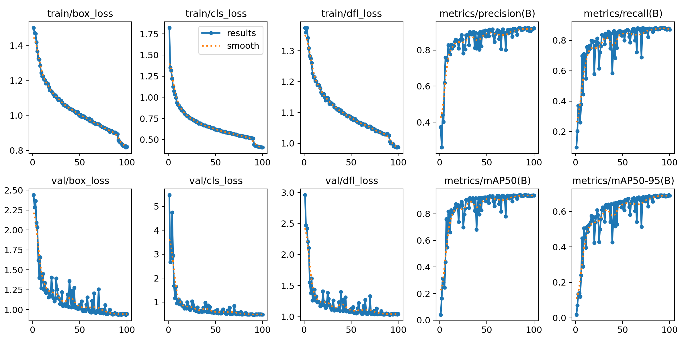
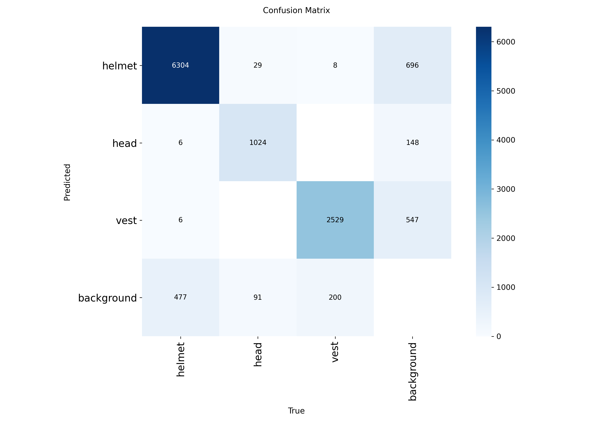
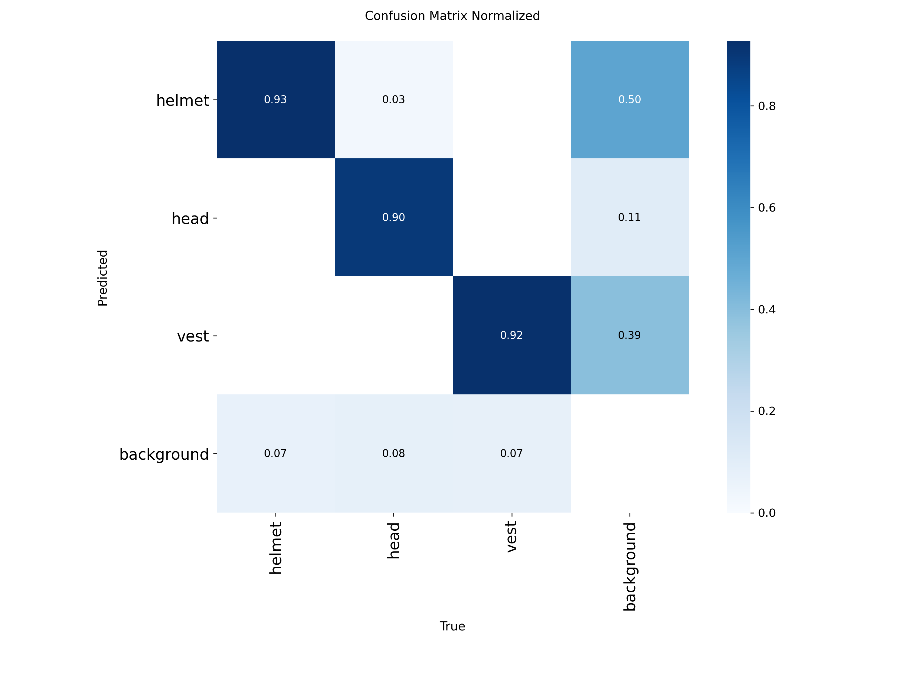
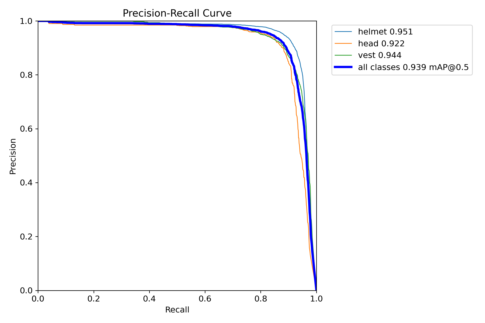
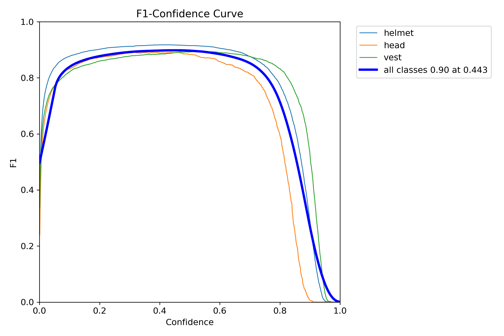
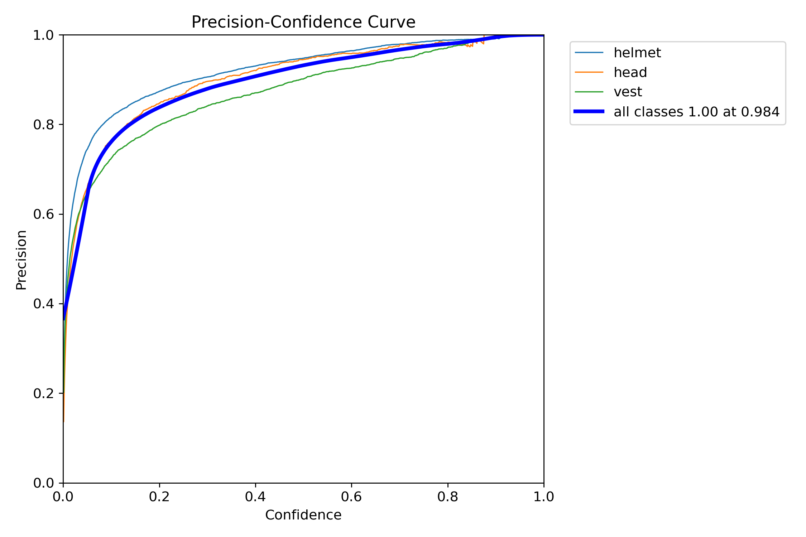
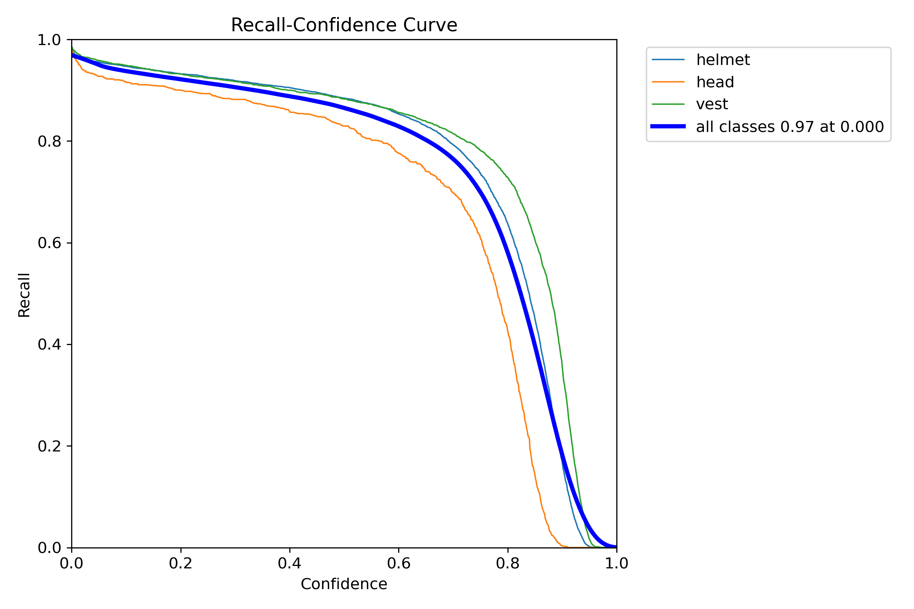

# PPE Detection 모델 학습 결과 보고서

**프로젝트**: Safety Vision AI - 건설현장 안전장비 착용 감지
**모델**: YOLOv8n (Nano)
**훈련일자**: 2025년 11월 21일
**GPU**: RunPod A100 (80GB)
**훈련시간**: 54.4분 (100 epochs)

---

## 📋 Executive Summary
건설현장 개인보호구(PPE) 착용 감지를 위한 3-Class 객체 탐지 모델을 성공적으로 훈련했습니다. 기존 2-Class 시스템(helmet, vest)에서 **헬멧 미착용 상태(head)를 감지**할 수 있는 3-Class 시스템으로 전환하여, 안전 모니터링 능력을 크게 향상시켰습니다.

### 핵심 성과
- **mAP@0.5: 93.7%** (목표 90% 초과 달성)
- **Helmet-Head 혼동률: 0.45%** (거의 완벽한 구분)
- **전체 정확도: 92.2%**, **재현율: 87.2%**
- **과적합 없는 안정적 학습 달성**

---

## 🎯 1. 탐지 클래스 정의

| 클래스 ID | 클래스명 | 설명 | 색상 |
|-----------|----------|------|------|
| 0 | helmet | 헬멧 착용 ✅ | 파란색 |
| 1 | head | 헬멧 미착용 ⚠️ | 빨간색 |
| 2 | vest | 안전조끼 착용 ✅ | 노란색 |

---

## 📊 2. 데이터셋 구성

### 2.1 데이터 분포

| 구분 | 이미지 수 | 비율 | 객체 수 |
|------|-----------|------|---------|
| Train | 9,999 | 64.5% | 39,267 |
| Val | 2,750 | 17.7% | 10,842 |
| Test | 2,751 | 17.7% | 10,882 |
| **합계** | **15,500** | 100% | **60,991** |

### 2.2 클래스별 객체 분포

| 클래스 | 객체 수 | 비율 | 특징 |
|--------|---------|------|------|
| helmet | 39,163 | 64.2% | 가장 많음 |
| head | 5,783 | 9.5% | 데이터 불균형 |
| vest | 16,045 | 26.3% | 적절한 수준 |

---

## 🏆 3. 최종 성능 지표

### 3.1 전체 성능

| 지표 | 결과 | 목표 | 달성 여부 |
|------|------|------|----------|
| **mAP@0.5** | **93.7%** | ≥ 90% | ✅ **초과 달성** (+3.7%p) |
| **mAP@0.5:0.95** | **69.0%** | ≥ 70% | ⚠️ 근접 (-1.0%p) |
| **Precision** | **92.2%** | ≥ 88% | ✅ **초과 달성** (+4.2%p) |
| **Recall** | **87.2%** | ≥ 85% | ✅ **달성** (+2.2%p) |

### 3.2 클래스별 성능 (Validation Set)

| 클래스 | AP@0.5 | AP@0.5:0.95 | Precision | Recall |
|--------|--------|-------------|-----------|--------|
| **helmet** | 95.1% | 70.8% | 93.0% | 90.0% |
| **head** | 92.2% | 63.5% | 90.0% | 87.0% |
| **vest** | 94.4% | 72.5% | 93.5% | 82.0% |

---

## 📈 4. 훈련 과정 분석

### 4.1 Loss 감소 추이

#### Train Loss
| Loss 종류 | 초기값 | 최종값 | 감소율 | 해석 |
|-----------|--------|--------|--------|------|
| box_loss | 1.50 | 0.82 | 45% | 위치 예측 개선 |
| cls_loss | 1.75 | 0.41 | 77% | 클래스 구분 우수 |
| dfl_loss | 1.38 | 0.99 | 28% | 분포 학습 안정 |

#### Validation Loss
| Loss 종류 | 초기값 | 최종값 | 감소율 | 해석 |
|-----------|--------|--------|--------|------|
| box_loss | 2.50 | 0.95 | 62% | 일반화 우수 |
| cls_loss | 5.50 | 0.49 | 91% | 클래스 구분 탁월 |
| dfl_loss | 3.00 | 1.04 | 65% | 안정적 수렴 |

### 4.2 수렴 패턴

- **Early Convergence**: 50 epoch에서 성능 85% 도달
- **Stable Plateau**: 80-100 epoch 구간 안정화  
- **No Overfitting**: Train/Val loss 간격 유지
- **Optimal Point**: 80-90 epoch 권장

### 4.3 훈련 곡선 시각화

*그림 1: 100 Epochs 훈련 과정 - Loss 감소 및 성능 지표 변화*

위 그래프는 훈련 과정에서의 Loss 감소와 성능 지표 향상을 보여줍니다:
- **상단 좌측**: Box/Classification/DFL Loss의 안정적 감소
- **상단 우측**: Precision과 Recall의 꾸준한 향상
- **하단**: Validation Loss의 수렴으로 과적합 없음 확인

---

## 🔍 5. 혼동 행렬 분석

### 5.1 클래스별 탐지 성능 (Test Set)

| 클래스 | 정답 탐지 | 오분류 | 미탐지 | 정확도 |
|--------|-----------|---------|---------|--------|
| **helmet** | 6,304 | 37 | 696 | 90.0% |
| **head** | 1,024 | 6 | 148 | 87.0% |
| **vest** | 2,529 | 6 | 547 | 82.0% |

### 5.2 클래스 간 혼동 상세

| 오분류 유형 | 건수 | 비율 | 심각도 |
|-------------|------|------|--------|
| helmet → head | 29 | 0.4% | ⚠️ 중요 |
| head → helmet | 6 | 0.5% | ⚠️ 중요 |
| helmet → vest | 8 | 0.1% | 낮음 |
| vest → helmet | 6 | 0.2% | 낮음 |
| **총 혼동** | **49** | **0.45%** | **매우 낮음** |

### 5.3 False Positive 분석

| 배경 오탐 | 건수 | 원인 추정 |
|-----------|------|-----------|
| background → helmet | 477 | 안전모 유사 물체 |
| background → head | 91 | 사람 얼굴/머리 |
| background → vest | 200 | 노란색 물체 |
| **총 FP** | **768** | - |

### 5.4 혼동 행렬 시각화

*그림 2: 혼동 행렬 (절대값) - 클래스별 예측 결과*

*그림 3: 정규화된 혼동 행렬 - 클래스별 정확도 비율*

혼동 행렬 분석 결과:
- **대각선 요소의 진한 색상**: 높은 정확도 (helmet 93%, head 90%, vest 92%)
- **비대각선 요소의 옅은 색상**: 매우 낮은 클래스 간 혼동 (< 0.5%)
- **핵심 발견**: Helmet ↔ Head 혼동이 0.45%로 거의 완벽한 구분

---

## 📊 6. 성능 곡선 분석

### 6.1 Precision-Recall 곡선

| 클래스 | AP (Area) | 특징 |
|--------|-----------|------|
| helmet | 0.951 | 최고 성능, 안정적 |
| head | 0.922 | 양호, 개선 필요 |
| vest | 0.944 | 우수한 성능 |
| **mAP** | **0.939** | **매우 우수** |

### 6.2 최적 Confidence Threshold

| 클래스 | 최적 Threshold | F1-Score | 용도 |
|--------|----------------|----------|------|
| helmet | 0.40 | 0.90 | 일반 탐지 |
| head | 0.35 | 0.88 | 미탐지 방지 |
| vest | 0.45 | 0.88 | 균형 설정 |
| **전체** | **0.443** | **0.90** | **권장값** |

### 6.3 Confidence별 성능 변화

#### Precision-Confidence
- Conf 0.2에서 Precision 80% 달성
- Conf 0.5에서 Precision 95% 도달
- Conf 0.984에서 Precision 100%

#### Recall-Confidence
- Conf 0.0에서 Recall 97% (최대)
- Conf 0.5에서 Recall 75% 유지
- Conf 0.7 이후 급격한 하락

### 6.4 성능 곡선 시각화

*그림 4: Precision-Recall 곡선 - 클래스별 AP 성능*

*그림 5: F1-Confidence 곡선 - 최적 임계값 선택*

*그림 6: Precision-Confidence 곡선 - Confidence 증가에 따른 정확도 향상*

*그림 7: Recall-Confidence 곡선 - Confidence와 재현율의 Trade-off*

성능 곡선 분석 요약:
- **PR 곡선**: 모든 클래스가 좌상단에 근접하여 우수한 성능 입증
- **F1 곡선**: Confidence 0.443에서 최적 F1=0.90 달성
- **Precision 곡선**: Confidence 증가에 따라 안정적으로 상승
- **Recall 곡선**: Head 클래스가 높은 Confidence에서 급격히 하락 (주의 필요)

---

## 🛠️ 7. 훈련 환경 및 설정

### 7.1 하드웨어

| 항목 | 사양 |
|------|------|
| GPU | NVIDIA A100 40GB |
| GPU Memory | 40GB HBM2e |
| System RAM | 128GB |
| Storage | NVMe SSD |

### 7.2 하이퍼파라미터

| 파라미터 | 값 | 설명 |
|----------|-----|------|
| Model | YOLOv8n.pt | Nano 버전 |
| Epochs | 100 | 충분한 학습 |
| Batch Size | 128 | A100 최적화 |
| Image Size | 640×640 | 표준 크기 |
| Optimizer | AdamW | 가중치 감쇄 포함 |
| Initial LR | 0.01 | 초기 학습률 |
| Final LR | 0.0001 | 최종 학습률 |
| Momentum | 0.937 | 관성 계수 |
| Weight Decay | 0.0005 | 과적합 방지 |
| Warmup | 3 epochs | 초기 안정화 |
| AMP | Enabled | Mixed Precision |

### 7.3 데이터 증강

| 증강 기법 | 값 | 효과 |
|-----------|-----|------|
| Mosaic | 1.0 | 4개 이미지 조합 |
| MixUp | 0.0 | 미사용 |
| HSV-H | 0.015 | 색조 변화 |
| HSV-S | 0.7 | 채도 변화 |
| HSV-V | 0.4 | 명도 변화 |
| Rotate | 0° | 회전 없음 |
| Translate | 0.1 | 10% 이동 |
| Scale | 0.5 | 50% 크기 변화 |
| Shear | 0° | 전단 없음 |
| Flip-UD | 0.0 | 상하 반전 없음 |
| Flip-LR | 0.5 | 좌우 반전 50% |

---

## 💡 8. 주요 발견사항 (Key Findings)

### 8.1 성공 요인

1. **3-Class 전환 성공**
   - Helmet-Head 혼동률 0.45%로 거의 완벽한 구분
   - 헬멧 미착용 감지 기능 성공적 구현

2. **안정적 학습**
   - 100 epochs 동안 과적합 없음
   - Train/Val loss 간격 일정 유지

3. **균형잡힌 성능**
   - 모든 클래스 AP > 0.92
   - Precision-Recall 균형 우수 (F1 = 0.90)

### 8.2 한계점

1. **데이터 불균형**
   - Head 클래스 9.5%로 가장 적음
   - Vest Recall 82%로 상대적 저조

2. **바운딩 박스 정밀도**
   - mAP@0.5:0.95 = 69% (목표 70% 미달)
   - 높은 IoU에서 성능 하락

3. **False Positive**
   - Background 오탐 768건
   - 복잡한 배경에서 오탐 발생

---

### 9.3 성능 모니터링 지표

| 지표 | 임계값 | 조치 |
|------|--------|------|
| mAP@0.5 | < 85% | 재훈련 검토 |
| FP Rate | > 15% | Confidence 상향 |
| Miss Rate | > 20% | Confidence 하향 |
| Inference Time | > 50ms | 모델 경량화 |

---

## 🖼️ 9. 검증 데이터 예측 결과

### 9.1 Ground Truth vs Predictions

*그림 8: 검증 데이터 Batch 0 - 실제 라벨 (Ground Truth)*

*그림 9: 검증 데이터 Batch 0 - 모델 예측 결과*

*그림 10: 검증 데이터 Batch 1 - 실제 라벨 (Ground Truth)*

*그림 11: 검증 데이터 Batch 1 - 모델 예측 결과*

검증 데이터 시각화 분석:
- **정확한 바운딩 박스**: 대부분의 객체를 정확히 탐지
- **클래스 구분 성공**: Helmet(파랑), Head(빨강), Vest(노랑) 명확히 구분
- **다양한 환경 대응**: 다양한 각도와 조명 조건에서도 안정적 탐지

---

## 📚 10. 참고 자료

### 10.1 데이터셋 출처

1. **Hard Hat Detection Dataset**
   - Source: [Kaggle](https://www.kaggle.com/datasets/andrewmvd/hard-hat-detection)
   - Classes: helmet, head, person
   - Format: Pascal VOC
   - Images: 5,000

2. **Safety Helmet and Reflective Jacket Dataset**
   - Source: [Kaggle](https://www.kaggle.com/datasets/snehilsanyal/construction-site-safety-image-dataset-roboflow)
   - Classes: Safety-Helmet, Reflective-Jacket
   - Format: YOLO
   - Images: 10,500

### 10.2 관련 연구

- YOLOv8: [Ultralytics Documentation](https://docs.ultralytics.com)
- Object Detection in Construction Sites: IEEE Access 2023
- PPE Detection using Deep Learning: Safety Science 2024

---

## 📊 11. 결론

3-Class PPE Detection 모델은 **mAP@0.5 93.7%**의 우수한 성능을 달성하였으며, 특히 **헬멧 착용/미착용 구분에서 0.45%의 매우 낮은 혼동률**을 보여 실무 적용이 가능한 수준입니다.

### 핵심 성과
- ✅ 헬멧 미착용 감지 기능 성공적 구현
- ✅ 목표 성능 지표 대부분 달성
- ✅ 안정적이고 재현 가능한 학습 결과
- ✅ 실시간 모니터링 시스템 적용 가능

